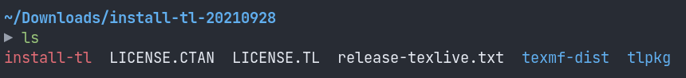
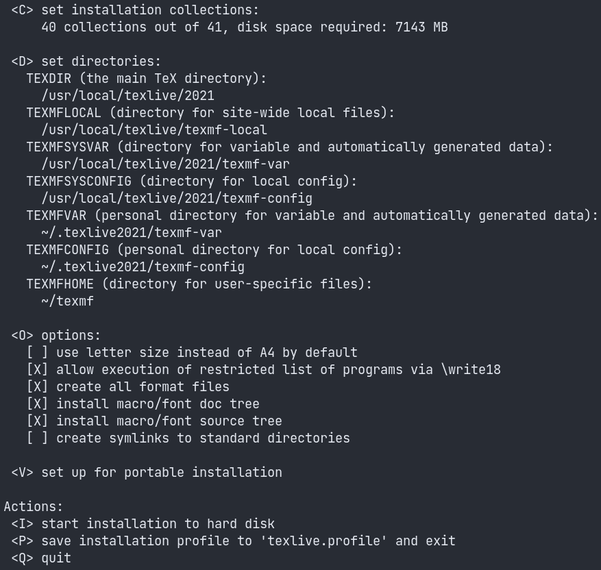
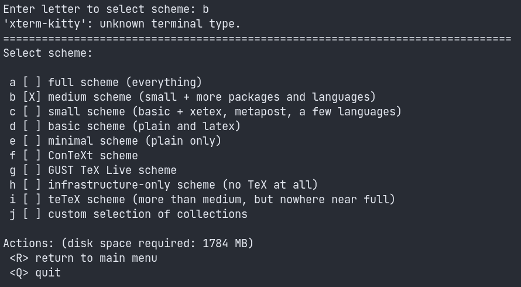

# The Story
Recently, I wanted to install a TeX system on my Ubuntu 20.04 PC. I tried installing MiKTeX after someone recommended it to me (thrice...), but I found myself unable to update TeX packages because of a cryptic SSL peer certificate error. I reported this in an [issue](https://github.com/MiKTeX/miktex/issues/935) to the MiKTeX repo, but was instead told that my system did not support MiKTeX. Great.

Next, I tried to install TeX Live. It seemed simple enough, with a `sudo apt install texlive`. Can't get any easier than this, right?

So it turns out that the apt package for TeX Live is still the 2019 version. Now unfortunately, this meant that I again could not update packages, since `tlmgr`, TeX Live's package manager could not verify the signature for a repository. I tried following [this post on TeX Stack Exchange](https://tex.stackexchange.com/questions/528634/tlmgr-unexpected-return-value-from-verify-checksum-5), but this didn't work out.

So I decided to ditch APT, and tried following the [TeX Live Quick Install docs](https://www.tug.org/texlive/quickinstall.html) (which is probably I should have done first). But even in this method, the default mirror which was chosen was too slow, and for some reason, the default, _recommended_ scheme to install TeX Live (called _full scheme_) installs around    5GB of TeX software - fonts, packages, et cetera. For someone beginning with TeX, this did not sit well with me.

Enough with this rant, let me list down the steps that I followed to install TeX Live on my system. Note that there are most likely better methods/choices that one could use, but these steps worked for me.

# What is TeX?
Simply said, TeX is a popular typesetting system, especially in academia, that enables one to write documents that involve a lot of formatting, mathematical equations, tables et cetera. It was made by ACM Turing Awardee [Donald Knuth](https://en.wikipedia.org/wiki/Donald_Knuth) (who is a legend, by the way).

# TeX Live Installation
TeX Live is a software distribution for TeX, and includes some programs, macros, packages and fonts. It has a package manager specifically for TeX packages, called `tlmgr`, that is used to install and update TeX packages.

1. Download `install-tl` (the latest one, yay!) using [this link](https://mirror.ctan.org/systems/texlive/tlnet/install-tl-unx.tar.gz). In case this gets changed, you can find the link [in the docs](https://www.tug.org/texlive/acquire-netinstall.html) (Do read the docs once before installing). Extract the contents from the .tar.gz file. Here's how the contents look:


<!--  -->

2. Run the `install-tl` Perl script as root. Note that the script does not require root permissions, but requires write access to the directory where it's going to install, which by default is `/usr/local`. You can change the directory by looking at the prompts of the script. 

    Note that you can run the installer in GUI mode by the `-gui` flag (which I would recommend if you're doing this for the first time, but it requires Tcl to be installed). 
    
    The `--repository` option specifies an explicit mirror to use. Try specifying some other [mirrors](https://ctan.org/mirrors?lang=en) if the default mirror seems too slow. In my case, the mirror provided by NUS (and I stay in Mumbai) was much better than the default one.

```bash
sudo perl install-tl [-gui] [--repository <URL>]
```


I came across the following error when I tried using an explicit mirror:
```
install-tl: TLPDB::from_file could not initialize from: https://mirrors.dotsrc.org/ctan/tlpkg/texlive.tlpdb
install-tl: Maybe the repository setting should be changed.
install-tl: More info: https://tug.org/texlive/acquire.html
```
Try appending `systems/texlive/tlnet` to the mirror URL when running the `install-tl` script. For example,
```bash
 sudo perl install-tl --repository https://download.nus.edu.sg/mirror/ctan/systems/texlive/tlnet
 ```


3. After a few seconds, something similar to the following will be visible:

<!--  -->
If you scroll up, you can see the scheme selected by default for installation:
`<S> set installation scheme: scheme-full`. Below that, you can see the number of collections and the space they'll take:

```
 <C> set installation collections:
     40 collections out of 41, disk space required: 7143 MB
```
> 7GB by default, not cool.

4. Enter "S" as the command (upper or lower case), and then you can select the scheme you want. I selected the "medium scheme", which takes around 1.7 GB, obviously at the cost of lesser functionality. But you can install packages as you like later on, using `tlmgr`. 

    After you've selected the scheme you want, enter "R" to return to the main menu, as the prompt will tell you. Then enter "I" to begin installation.

<!--  -->

5. Depending (a lot!) on the mirror you chose, your installation of TeX Live should finally be complete. For me, it took around 15 minutes. 
    
    Next, you need to update your `PATH` environment variable so that it knows where to find TeX Live binaries. If you went along with the default settings, the path you need to add to your `PATH` would be something like `/usr/local/texlive/2021/bin/x86_64-linux`. Move around inside `/usr/local/texlive` to verify this. 

    You can update your `.profile` (log out and log in again for changes to take place) or `.bashrc` or `.zshrc` or whatever (source the configuration file for changes to take place) by adding this line:
```bash
PATH=/usr/local/texlive/2021/bin/x86_64-linux:$PATH 
```

# Installing a LaTeX editor
I installed TeXstudio by simply (painlessly) using APT.
```bash
sudo apt install texstudio
```
I'm happy to say that this worked fine! Most TeX editors should be able to configure the backend (TeX Live, in our case) automatically, provided you have set your `PATH` variable and your shell knows about it.



# References
[Quick Install - TeX Live](https://tug.org/texlive/quickinstall.html)

[Installing TeX Live over the Internet](https://www.tug.org/texlive/acquire-netinstall.html)

[For the tlpdb error: An answer in a forum discussing "Problems installing TeXlive in CentOS7"](https://narkive.com/i3g0zxJ0.4)

